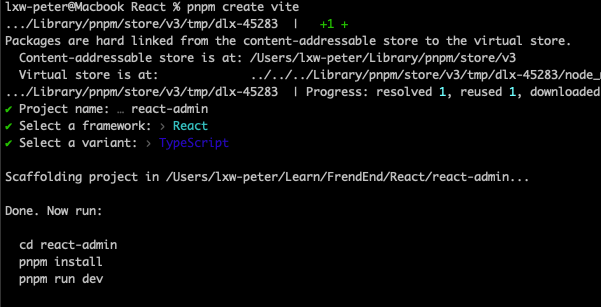

# React + Antd 管理后台

## 初始化项目

```sh
# 全局安装 pnpm
npm i pnpm -g
# 使用pnpm 创建 vite 项目，并选择 react + typescript
pnpm create vite
# 安装
cd react-admin
pnpm i
```



## 安装依赖

```sh
pnpm i antd @ant-design/icons react-router-dom axios nprogress
```
